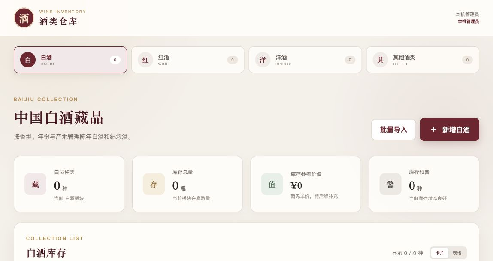
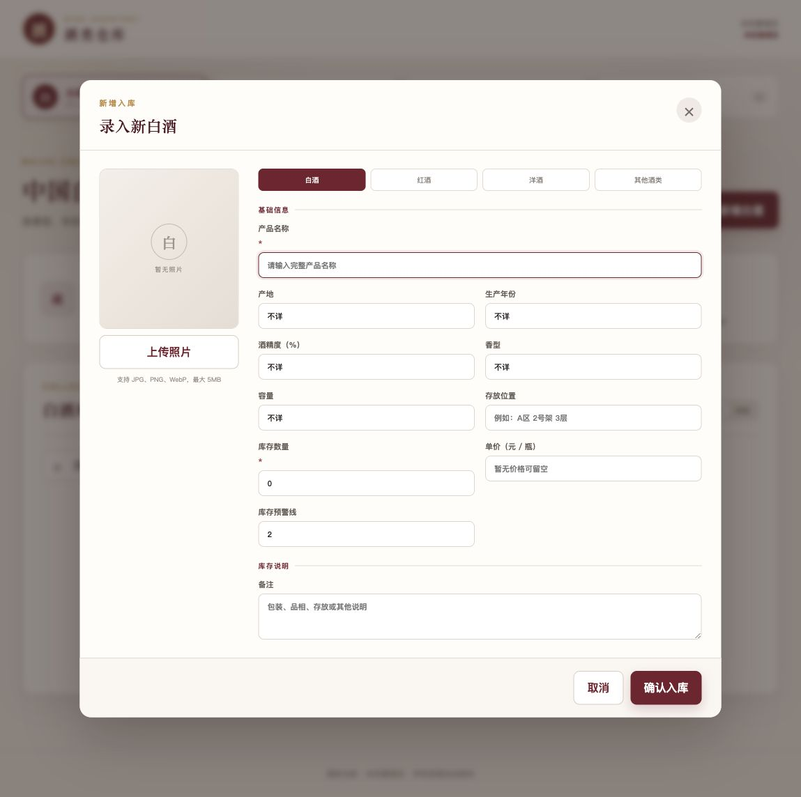
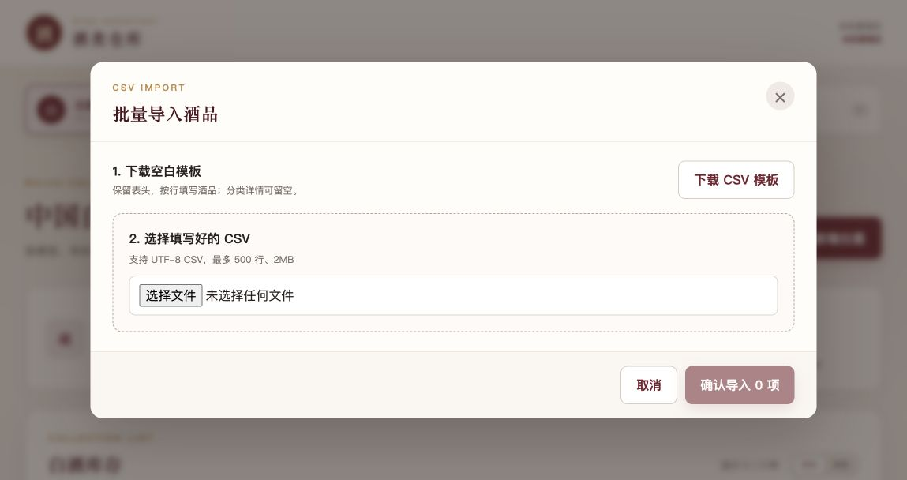

# 🍷 酒类仓库库存管理系统

> 把散落在纸张、聊天记录和 Excel 里的酒，收进一座清清楚楚的数字酒库。

这是一套可自托管的中文酒类库存管理系统，适合个人酒窖、收藏室、小型酒行和仓库使用。它没有预装任何酒品、照片或演示库存——第一次打开时，酒库是完全空白的，等你亲手建立自己的收藏。

[](LICENSE)
[](package.json)
[](https://react.dev/)
[](https://www.typescriptlang.org/)
[](https://github.com/linyue828-boop/wine-inventory-system/stargazers)

<p>
  <a href="#local-start"><strong>🚀 本地启动</strong></a>
  ·
  <a href="#netlify-deploy"><strong>☁️ 部署到 Netlify</strong></a>
  ·
  <a href="#csv-import"><strong>📦 批量导入</strong></a>
  ·
  <a href="https://github.com/linyue828-boop/wine-inventory-system/issues"><strong>💬 提交建议</strong></a>
</p>



<p align="center">
  <em>空白开源版首页：库存统计、分类筛选与视图切换一目了然。</em>
</p>

## 👋 这是为谁准备的？

- 想把家庭酒柜或个人酒窖数字化的收藏者
- 仍在使用纸张、聊天记录或零散 Excel 管理库存的小型酒行
- 需要记录入库、出库、库位和低库存提醒的仓库
- 想寻找中文、可自托管库存系统的开发者和团队
- 希望基于 React、TypeScript 和 SQLite 二次开发的开源爱好者

不需要先清理示例数据：项目首次启动就是一座完全空白的酒库。你的库存数据库、照片和登录密钥也不会被提交到 Git 仓库。

## ✨ 它能帮你做什么？

| 场景 | 功能 |
| --- | --- |
| 酒太多，记不清放在哪里 | 记录库位、年份、容量、香型、产区和分类专属信息 |
| 入库出库靠心算 | 快速入库、出库、盘点，并自动保存数量变更历史 |
| 想知道哪些酒快没了 | 自定义库存预警线，一眼筛出低库存酒品 |
| 原有数据都在表格里 | 下载 CSV 空白模板，预览校验后一次导入最多 500 项 |
| 想为每瓶酒留下照片 | 上传 JPG、PNG 或 WebP，保持原始比例完整预览 |
| 想看看酒库大概值多少 | 填写可选单价，自动统计库存参考价值 |
| 想在不同设备上共享 | 可部署到 Netlify，通过邀请码访问云端酒库 |

### 核心特点

- **真正的空白开源版**：不捆绑私人酒品、品牌图片或演示库存
- **完整库存流水**：每次入库、出库和盘点都有历史记录
- **CSV 安全批量导入**：先预览、后写入，发现错误时整批停止
- **分类专属档案**：不同酒类显示不同的详细字段
- **本地优先**：SQLite 和上传图片都保存在自己的设备中
- **可选云端部署**：通过 Netlify Functions 和 Blobs 跨设备使用
- **响应式中文界面**：桌面浏览器和移动设备均可操作

系统提供四个独立板块：

- 🥃 **白酒**：产地、年份、酒精度、香型、容量
- 🍷 **红酒**：酒庄、国家、产区、葡萄品种、类型、橡木桶信息
- 🥃 **洋酒**：酒种、酒厂、酒龄、蒸馏年份、装瓶年份、桶型与桶号
- 🍶 **其他酒类**：米酒、黄酒、果酒、药酒等灵活信息

## 🖼️ 功能界面

### 一张表单，收好一瓶酒的完整档案

从分类、名称、产地和年份，到库存、单价、库位、预警线与照片，都可以在同一个窗口中完成。开源版不包含任何酒类素材，所有内容由使用者自行添加。



### 一次导入整份库存

下载空白模板、填写 CSV、上传预览、修正错误，再确认写入。批量导入不会跳过错误悄悄留下不完整数据。



<a id="csv-import"></a>

## 📦 批量导入，不用一瓶一瓶录

点击页面上的“批量导入”，下载空白 CSV 模板，填写后重新选择文件。系统会先检查每一行并展示预览；只要存在错误行，就不会写入数据。

模板中的常用字段包括：

```csv
名称,分类,产地,年份,酒精度,香型,容量,库存数量,单价,库位,预警线,备注,分类详情(JSON)
我的第一瓶酒,红酒,法国,2020,13.5%,不详,750ml,6,299,A-01,2,私人收藏,"{""winery"":""自定义酒庄"",""grape"":""赤霞珠""}"
```

导入规则：

- `分类`：白酒、红酒、洋酒、其他酒类，也接受 `baijiu`、`wine`、`spirits`、`other`
- `库存数量`、`预警线`：非负整数
- `单价`：非负数字，也可以留空
- `分类详情(JSON)`：可留空，例如红酒可填写 `{"winery":"示例酒庄","grape":"赤霞珠"}`
- 每次最多 500 行，CSV 文件最大 2MB
- 图片不通过 CSV 导入，可在导入后逐项上传

本机批量导入使用 SQLite 事务：要么整批成功，要么整批回滚，不会留下只导入一半的尴尬局面。

<a id="local-start"></a>

## 🚀 三分钟启动

需要安装 Node.js 22.5+ 和 pnpm。

```bash
git clone https://github.com/linyue828-boop/wine-inventory-system.git
cd wine-inventory-system
pnpm install
pnpm build
pnpm start
```

然后访问 [http://127.0.0.1:8787](http://127.0.0.1:8787)。

> [!IMPORTANT]
> 不要直接双击或用浏览器打开根目录的 `index.html`。这是 React/Vite 项目，必须通过上面的本地服务地址访问。

开发模式：

```bash
pnpm dev
```

Mac 用户在安装依赖并完成构建后，也可以双击 `启动酒库.command`。

<a id="netlify-deploy"></a>

## ☁️ 部署到 Netlify

项目已经包含 `netlify.toml`。你可以先从此仓库创建自己的副本，再连接 Netlify：

[](https://app.netlify.com/start/deploy?repository=https://github.com/linyue828-boop/wine-inventory-system)

部署后需要在 Netlify 项目的环境变量中配置：

| 环境变量 | 用途 |
| --- | --- |
| `INVENTORY_INVITE_CODE` | 访问酒库的邀请码，请使用足够长的随机值 |
| `INVENTORY_SESSION_SECRET` | 签名登录会话的随机密钥 |

生成随机密钥：

```bash
openssl rand -hex 32
```

请勿把真实邀请码、密钥或 `.env` 文件提交到 Git。

Netlify 版本使用 Functions 和 Blobs 存储共享数据，适合少量可信成员使用。当前云端存储方式不适合高并发写入或严肃的多人库存业务。

### 部署检查清单

1. 在 Netlify 中导入本仓库或你的 Fork
2. 确认构建命令和发布目录由 `netlify.toml` 自动读取
3. 添加上面的两个环境变量
4. 触发一次新的生产部署
5. 使用邀请码登录，并添加一条测试库存

## 🗃️ 数据保存在哪里？

- 本机数据库：`data/inventory.sqlite`
- 本机上传图片：`data/uploads/`
- 云端数据：Netlify Blobs

`data/` 已加入 Git 忽略规则，你的真实库存和上传照片不会被提交到开源仓库。

备份前请先停止本地服务，然后完整复制 `data/` 目录。用于正式库存管理时，建议建立定期备份并实际演练一次恢复流程。

## 🧪 运行检查

```bash
pnpm test
pnpm build
```

自动化测试覆盖：

- 空白酒库首次初始化
- 新增、修改、删除和库存历史
- 图片上传校验
- CSV 批量导入与事务回滚
- 邀请码会话签名
- 库存角色权限规则

## 🧱 技术组成

| 层级 | 使用技术 |
| --- | --- |
| 前端 | React 19、TypeScript、Vite |
| 本地服务 | Node.js、内置 SQLite |
| 云端接口 | Netlify Functions |
| 云端存储 | Netlify Blobs |
| 测试 | Node.js Test Runner |

项目没有依赖庞大的后台框架，适合作为可直接使用的小工具，也方便继续学习和二次开发。

## 🧭 路线图

- [x] 空白酒库首次初始化
- [x] 酒品图片、库位、单价和低库存预警
- [x] 入库、出库、盘点和库存流水
- [x] CSV 批量预览与事务导入
- [x] 本地 SQLite 与 Netlify 部署
- [ ] Excel 文件直接导入导出
- [ ] 条形码或二维码定位
- [ ] 盘点清单打印
- [ ] 独立账号和操作人审计
- [ ] 事务型云端数据库
- [ ] 定时备份与一键恢复

## 🤝 一起把酒库建得更好

发现问题或有新想法，可以直接：

- [提交 Bug](https://github.com/linyue828-boop/wine-inventory-system/issues/new)
- [提出功能建议](https://github.com/linyue828-boop/wine-inventory-system/issues/new)
- Fork 仓库并提交 Pull Request
- 完善文档、测试或不同部署环境的说明

提交代码前，请至少运行：

```bash
pnpm test
pnpm build
```

如果这个项目帮你少翻了一张表格、少找了一次酒，欢迎点击右上角的 **Star ⭐**。它能让更多需要中文库存工具的人发现这座数字酒库。

## 📄 开源许可证

本项目采用 [MIT License](LICENSE)。你可以自由使用、修改和分发，请保留许可证声明。

---

<p align="center">
  Made for collectors, small wine shops and self-hosting enthusiasts.
</p>
